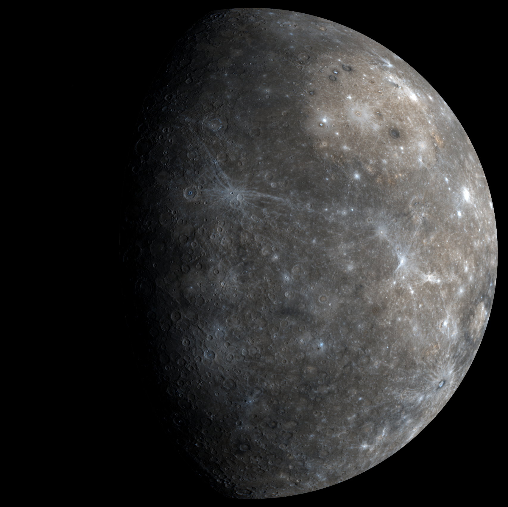

## v0.2.0 Mercury

Image Credit: NASA/Johns Hopkins University Applied Physics Laboratory/Carnegie Institution of Washington

### Fixed
- Tree View: shows VSCode error popup with Tree UI bugs https://github.com/opencaesar/oml-vision/pull/5

### Added
- Diagram View: Add export to SVG for diagrams https://github.com/opencaesar/oml-vision/pull/3
- Developer Experience: Add VSCode dev container https://github.com/opencaesar/oml-vision/pull/21
- Diagram View: Add ability to change node and node text color while automatically changing node color based on node type https://github.com/opencaesar/oml-vision/pull/22
- Diagram View: Add ability to animate edges https://github.com/opencaesar/oml-vision/pull/23
- Diagram View: Add ability to highlight/unlight connected edges to selected nodes https://github.com/opencaesar/oml-vision/pull/24
- Diagram View: Add ability to automatically apply a position layout to nodes and edges https://github.com/opencaesar/oml-vision/pull/24
- Diagram View: Add ability to apply a layout algorithm to nodes and edges https://github.com/opencaesar/oml-vision/pull/27
