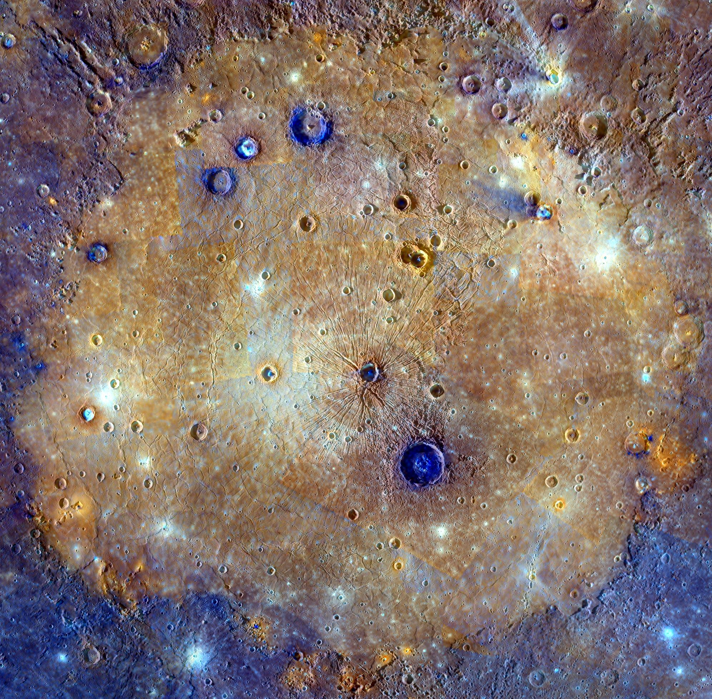

## v0.2.5 Caloris Basin

Image Credit: NASA/Johns Hopkins University Applied Physics Laboratory/Carnegie Institution Of Washington

### Fixed
- Table, Tree, and Diagram Views: cannot generate a view when there are more than 2 sets of layouts objects that contain the "children" attribute in the pages.json file https://github.com/opencaesar/oml-vision/pull/37

### Added
- Table, Tree, and Diagram Views: refactor layouts to support viewpoint definitions for each page https://github.com/opencaesar/oml-vision/pull/33
- Sidebar: add UI indication that data has been loaded into Fuseki RDF Triplestore https://github.com/opencaesar/oml-vision/pull/34
- Tree View: add ability to specify and edits columns https://github.com/opencaesar/oml-vision/pull/36
