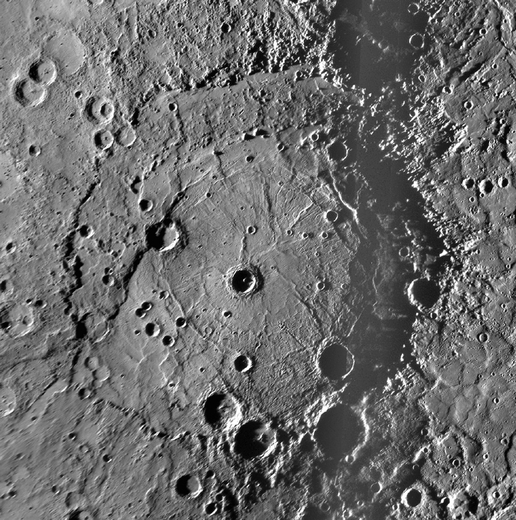

## v0.2.6 Rembrandt Basin

Image Credit: NASA/Johns Hopkins University Applied Physics Laboratory/Carnegie Institution Of Washington

### Added
- Property View: Allows users to see the properties of elements selected in the webview https://github.com/opencaesar/oml-vision/pull/42
- Property View: Allow users to specify a `number` type for controls in the property sheet https://github.com/opencaesar/oml-vision/pull/44

### Modified
- Viewpoints: Listen to viewpoints directory instead of layouts directory (Change layouts directory to viewpoints directory) https://github.com/opencaesar/oml-vision/issues/40