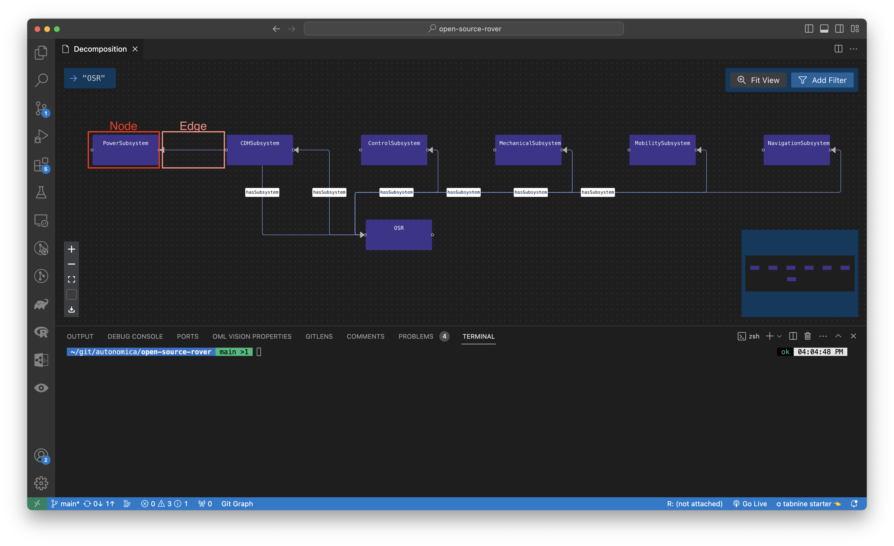
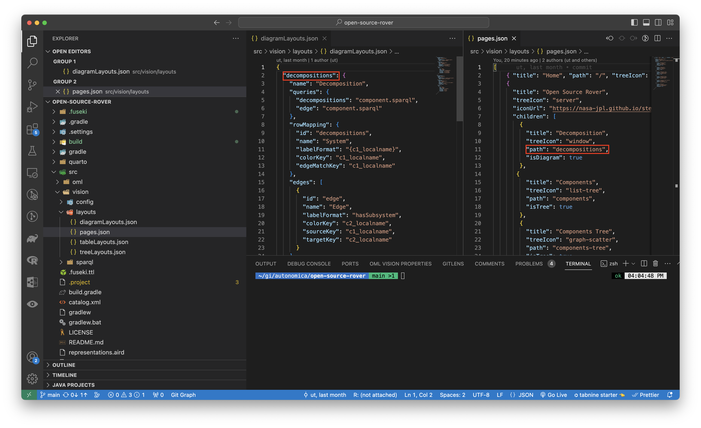
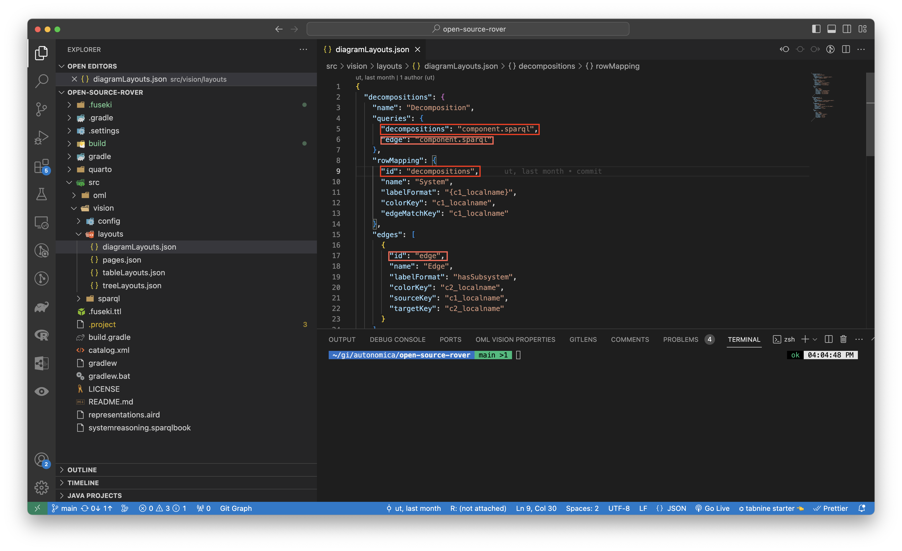
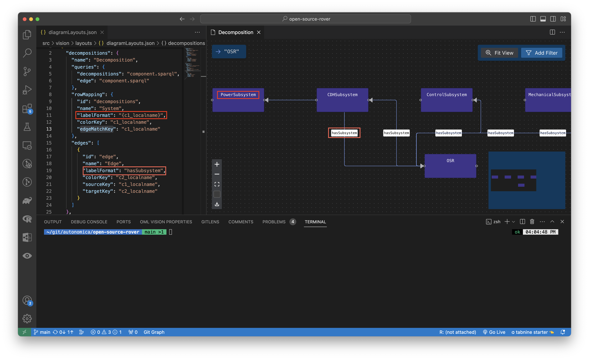

# Diagrams

Diagrams are created using [React Flow](https://reactflow.dev/).

:::info diagrams.json

Create a `src/vision/layouts/diagrams.json` file (case-sensitive)

:::

The `src/vision/layouts/diagrams.json` file is responsible for: 

- Defining what OML Vision Diagrams can render
  - Name of the Diagrams
  - Name of the nodes for the Diagram
  - Name of the edges for the Diagram
  - Queries for the Diagram node content
  - Queries for the Diagram edge content
  - How to map Diagrams node queries to edge queries

It is formatted as a JSON data structure.

<!-- TODO: Change to opencaesar repo -->
An example of what this looks like is seen below with the source code found [here](https://github.com/UTNAK/open-source-rover/blob/main/src/vision/layouts/diagramLayouts.json)

```json
{
  "decompositions": {
    "name": "Decomposition",
    "queries": {
      "decompositions": "component.sparql",
      "edge": "component.sparql"
    },
    "rowMapping": {
      "id": "decompositions",
      "name": "System",
      "labelFormat": "{c1_localname}",
      "colorKey": "c1_localname",
      "edgeMatchKey": "c1_localname"
    },
    "edges": [
      {
        "id": "edge",
        "name": "Edge",
        "labelFormat": "hasSubsystem",
        "colorKey": "c2_localname",
        "sourceKey": "c1_localname",
        "targetKey": "c2_localname"
      }
    ]
  },
  "movingscenario": {
    "name": "Scenario",
    "queries": {
      "movingscenario": "scenario_move.sparql",
      "edge": "scenario_move.sparql"
    },
    "rowMapping": {
      "id": "movingscenario",
      "name": "Task",
      "labelFormat": "{f2_id} \n {f2_cname}",
      "colorKey": "f2_id",
      "edgeMatchKey": "f2_id"
    },
    "edges": [
      {
        "id": "edge",
        "name": "Edge",
        "labelFormat": "invokes",
        "colorKey": "f2_id",
        "sourceKey": "f2_id",
        "targetKey": "f3_id"
      }
    ]
  }
}
```

## Defining Diagram

A Diagram must be properly defined in order to be rendered by OML Vision

### Terminology
OML Vision defines a node and edge as follows:

- Node: A graphical element that contains information
- Edge: A graphical element that connects information



### path
:::danger REQUIRED

```typescript
path: string
```

:::

This string defines the path of the Diagram.

:::tip USER INTERFACE

The name of the `path` is the same path that was defined in the `pages.json`.



:::

### name
:::note OPTIONAL

```typescript
name: string
```

:::


This string gives a name to the Diagram in the `diagramLayouts.json` file.  

### queries
:::danger REQUIRED

```typescript
queries: {}
```

:::

This object contains the queries that will query the RDF Triplestore for the content that will populate in the Diagram. 

**Look at the sparql docs for more info found [here](/docs/api-documentation/sparql)**

:::tip FUSEKI

You can test queries by going to localhost:3030 which is created once data is loaded into the Fuseki DB.  You can watch more info about testing queries with Fuseki by going [here](https://www.youtube.com/watch?v=w_pJ3XiBWeM&t=621s)

The AI & DS Channel (2021, February 18). SPARQL Query [Video]. YouTube. https://www.youtube.com/watch?v=w_pJ3XiBWeM&t=621s

:::

### rowMapping
:::danger REQUIRED

```typescript
rowMapping: {}
```

:::

This object defines how the `queries` map to the `columnNames`

#### id
:::danger REQUIRED

```typescript
id: string
```

:::

This string the `id` for the `rowMapping`.

:::tip USER INTERFACE

The `id` correspond to one of the `columnNames`.



:::

#### name
:::note OPTIONAL

```typescript
name: string
```

:::

This string gives a name to the `rowMapping`.  

#### labelFormat
:::danger REQUIRED

```typescript
labelFormat: string
```

:::

This string contains the label of the row for the `rowMapping`.

:::tip USER INTERFACE

The `labelFormat` is rendered in the rows of the Diagram shown in the red boxes.

**STRING INTERPOLATION**

OML Vision supports string interpolation with the queries that were formatted.  The format is `"{string}"`  

An example is found [here](https://github.com/UTNAK/open-source-rover/blob/main/src/vision/layouts/diagramLayouts.json#L11)



:::

#### colorKey
:::danger REQUIRED

```typescript
colorKey: string
```

:::

This string is the seed for a random color generator for the nodes rendered in the Diagram.  Needed to generate legend.

**STRING INTERPOLATION**

OML Vision supports string interpolation with the queries that were formatted.  The format is `"{string}"` 

#### edgeMatchKey
:::danger REQUIRED

```typescript
edgeMatchKey: string
```

:::

This string defines the edge for each node in the Diagram.

**STRING INTERPOLATION**

OML Vision supports string interpolation with the queries that were formatted.  The format is `"{string}"` 

#### subRowMappings
:::note OPTIONAL

```typescript
subRowMappings: {
    id: string
    name: string
    labelFormat: string
    colorKey: string
    edgeMatchKey: string
  }[]
```

:::

This `subRowMappings` array of objects defines the `id`, `name`, `labelFormat`, `colorKey`, and `edgeMatchKey` for the subrows of the Diagram.

**The `id`, `name`, `labelFormat`, `colorKey`, and `edgeMatchKey` have the same data structure as `rowMapping`**

### edges
:::danger REQUIRED

```typescript
edges: {
    id: string
    name: string
    labelFormat: string
    colorKey: string
    sourceKey: string
    targetKey: string
  }[]
```

:::

This `edges` array of objects defines the `id`, `name`, `labelFormat`, and `colorKey` for the edges of the Diagram.

**The `id`, `name`, `labelFormat`, and `colorKey` have the same data structure as `rowMapping`**

#### sourceKey
:::danger REQUIRED

```typescript
sourceKey: string
```

:::

This string defines the source node for the edge in the Diagram.


#### targetKey
:::danger REQUIRED

```typescript
targetKey: string
```

:::

This string defines the target node for the edge in the Diagram.
