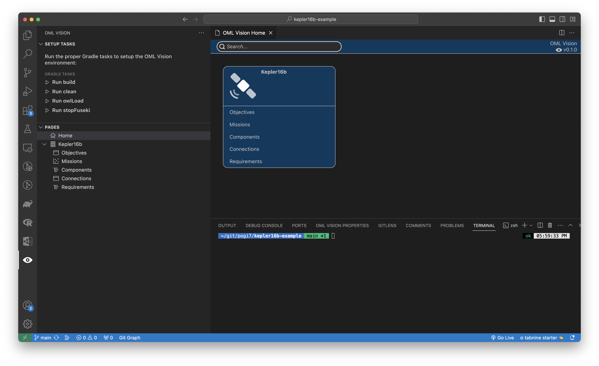
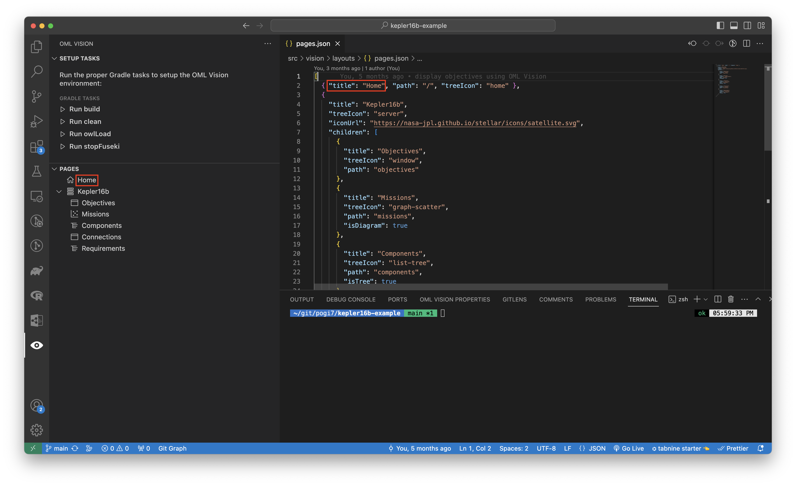
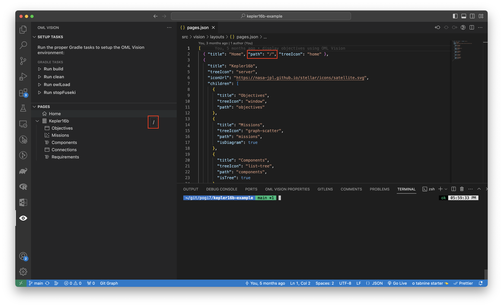
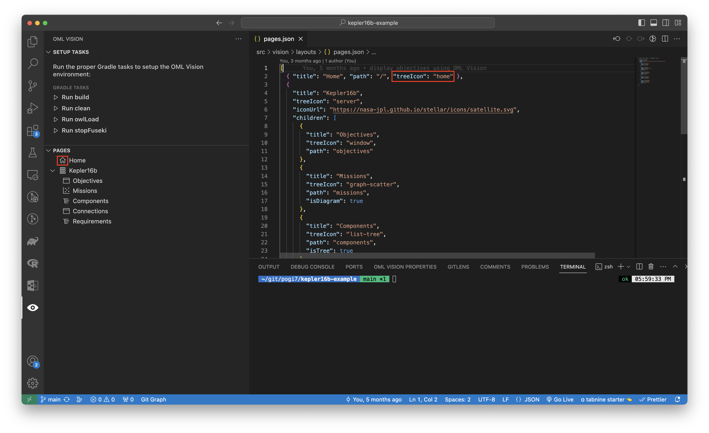
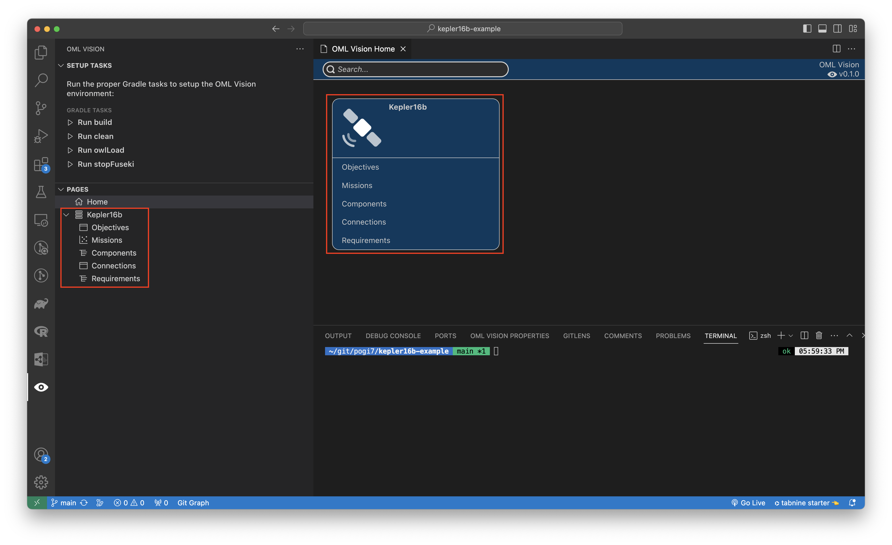
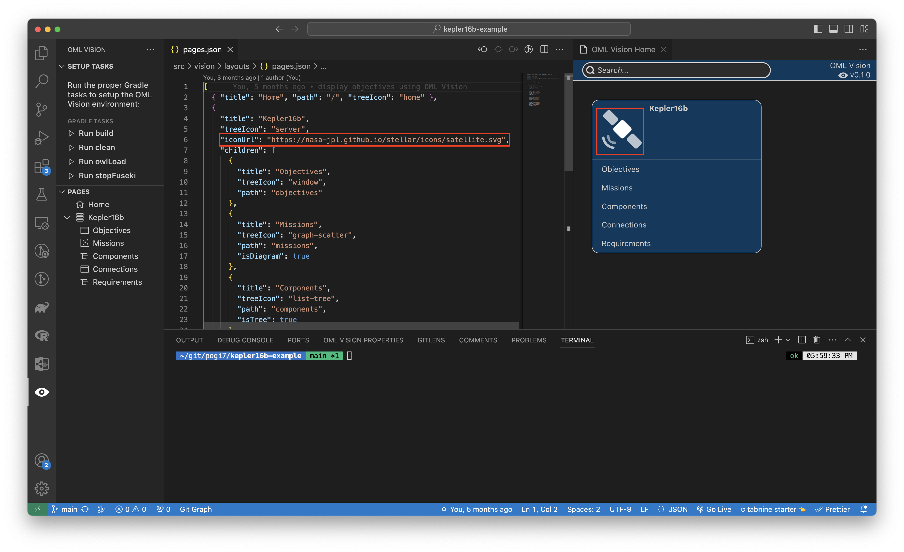
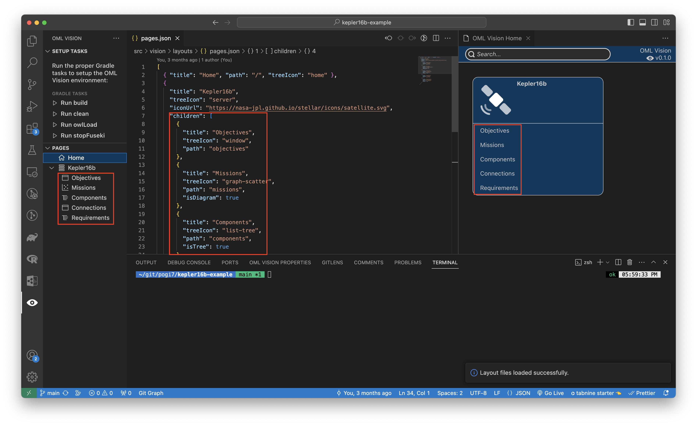

# Pages

:::info pages.json

Create a `src/vision/layouts/pages.json` file (case-sensitive)

:::

The `src/vision/layouts/pages.json` file is responsible for: 

- Defining what OML Vision can render
  - Home Page
    - Titles
    - Icons
  - Sidebar
    - Titles
    - Icons
  - Child Pages
    - Titles
    - Table, Tree, or Diagram
    - Icons
- Defining the path to the content that OML Vision renders

It is formatted as a JSON data structure.

<!-- TODO: Change to opencaesar repo -->
An example of what this looks like is seen below with the source code found [here](https://github.com/pogi7/kepler16b-example/blob/main/src/vision/layouts/pages.json)

```json
[
  { "title": "Home", "path": "/", "treeIcon": "home" },
  {
    "title": "Kepler16b",
    "treeIcon": "server",
    "iconUrl": "https://nasa-jpl.github.io/stellar/icons/satellite.svg",
    "children": [
      { 
        "title": "Objectives",
        "treeIcon": "window",
        "path": "objectives" 
      },
      {
        "title": "Missions",
        "treeIcon": "graph-scatter",
        "path": "missions",
        "isDiagram": true
      },
      {
        "title": "Components",
        "treeIcon": "list-tree",
        "path": "components",
        "isTree": true
      },
      {
        "title": "Connections",
        "treeIcon": "window",
        "path": "connections"
      },
      {
        "title": "Requirements",
        "treeIcon": "list-tree",
        "path": "requirements",
        "isTree": true
      }
    ]
  }
]
```

## Home Page

The home page acts as an entry point for users to navigate through the pages that OML Vision renders.



### title
:::danger REQUIRED

```typescript
title: string
```

:::


This string defines the title of the home page.  A good name for the home page is "Home" or "Frontpage"

:::tip USER INTERFACE

The name of the `title` is rendered in the sidebar for the OML Vision extension shown in the red boxes.



:::

### path
:::danger REQUIRED

```typescript
path: string
```

:::


This string defines the path of the page. 

**For the `Home Page` the path must be `/`**

:::tip USER INTERFACE

The name of the `path` is rendered in the sidebar when you hover and hold for 2 seconds over the `Home Page` in the OML Vision extension shown in the red boxes.



:::

### treeIcon
:::note OPTIONAL

```typescript
treeIcon: string
```

:::


This string defines the icon to be rendered in the sidebar next to the `Title` of the page. 

**A full list of available icons can be seen [here](https://code.visualstudio.com/api/references/icons-in-labels#icon-listing).  Use the `default codicon ID` as the value of the `treeIcon`**

:::tip USER INTERFACE

The `Home Page` icon of the `treeIcon` is rendered in the sidebar for the OML Vision extension shown in the red boxes.



:::

## Child Pages

Child pages are pages that are grouped with other similar pages.  The paths to these pages are rendered in the sidebar and in the `Home Page` shown in the red boxes.

**OML Vision supports more than 1 child page.**



### title
:::danger REQUIRED

```typescript
title: string
```

:::


This string defines the title of the child page.

:::tip USER INTERFACE

The name of the `title` is rendered in the sidebar and in the `Home Page`.

:::

### treeIcon
:::note OPTIONAL

```typescript
treeIcon: string
```

:::


This string defines the icon to be rendered in the sidebar next to the `Title` of the page. 

**A full list of available icons can be seen [here](https://code.visualstudio.com/api/references/icons-in-labels#icon-listing).  Use the `default codicon ID` as the value of the `treeIcon`**

:::tip USER INTERFACE

The `Child Page` icon of the `treeIcon` is rendered in the sidebar for the OML Vision extension.

:::

### iconUrl
:::danger REQUIRED

```typescript
iconUrl: string
```

:::


This string defines the path of the icon that is rendered in the home page. 

**Supported image file formats are .svg, .png, or .jpg**

:::tip USER INTERFACE

The `Child Page` icon of the `iconUrl` is rendered in the `Home Page` in the OML Vision extension shown in the red boxes.



:::

### children
:::danger REQUIRED

```typescript
children: {
    title: string;
    path: string;
    treeIcon: string;
    isTree: boolean;
    isDiagram: boolean;
  }[];
```

:::


This `children` array of objects defines the `title`, `path`, and `treeIcon` of the `Child Page`. 

**You can more than one `Child Page` in the `children` array.**

**By default all child pages are rendered as tables unless specified with the isTree or isDiagram booleans.**

:::tip USER INTERFACE

The `Child Pages` are rendered in the sidebar and in the `Home Page` of the OML Vision extension shown in the red boxes.



:::

#### title
:::danger REQUIRED

```typescript
title: string
```

:::


This string defines the title of the child page.

:::tip USER INTERFACE

The name of the `title` of the `Child Page` is rendered in the sidebar and in the `Home Page` of the OML Vision extension.

:::

#### path
:::danger REQUIRED

```typescript
path: string
```

:::


This string defines the path of the `Child Page`. 

**Remember this string as it will be needed for the layouts of the tables, trees, and diagrams**

:::tip USER INTERFACE

The name of the `path` is rendered in the sidebar when you hover and hold for 2 seconds over the `Child Page` in the OML Vision extension.

:::

#### treeIcon
:::note OPTIONAL

```typescript
treeIcon: string
```

:::


This string defines the icon to be rendered in the sidebar next to the `Title` of the page. 

**A full list of available icons can be seen [here](https://code.visualstudio.com/api/references/icons-in-labels#icon-listing).  Use the `default codicon ID` as the value of the `treeIcon`**

:::tip USER INTERFACE

The `Child Page` icon of the `treeIcon` is rendered in the sidebar for the OML Vision extension.

:::

#### isTree
:::note OPTIONAL

```typescript
isTree: boolean
```

:::


This bool specifies whether or not the `Child Page` will be a tree.  Set `isTree` to `true` to turn the `Child Page` into a tree.


#### isDiagram
:::note OPTIONAL

```typescript
isDiagram: boolean
```

:::


This bool specifies whether or not the `Child Page` will be a diagram.  Set `isDiagram` to `true` to turn the `Child Page` into a diagram.