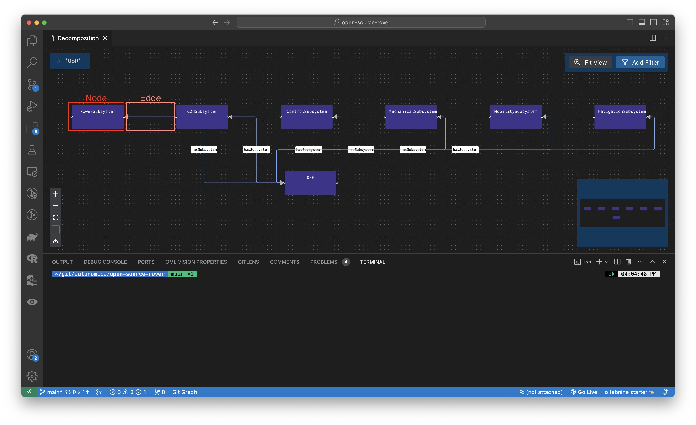
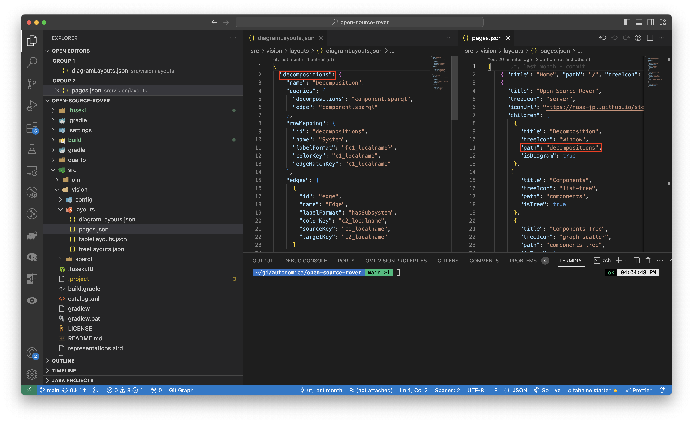
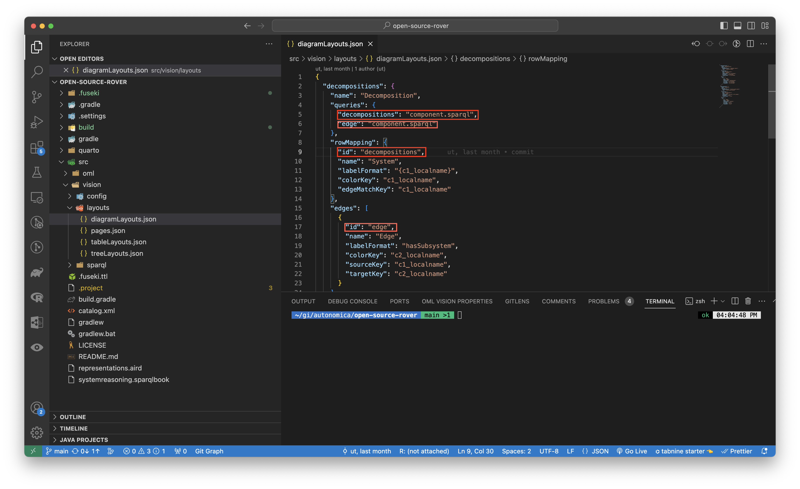
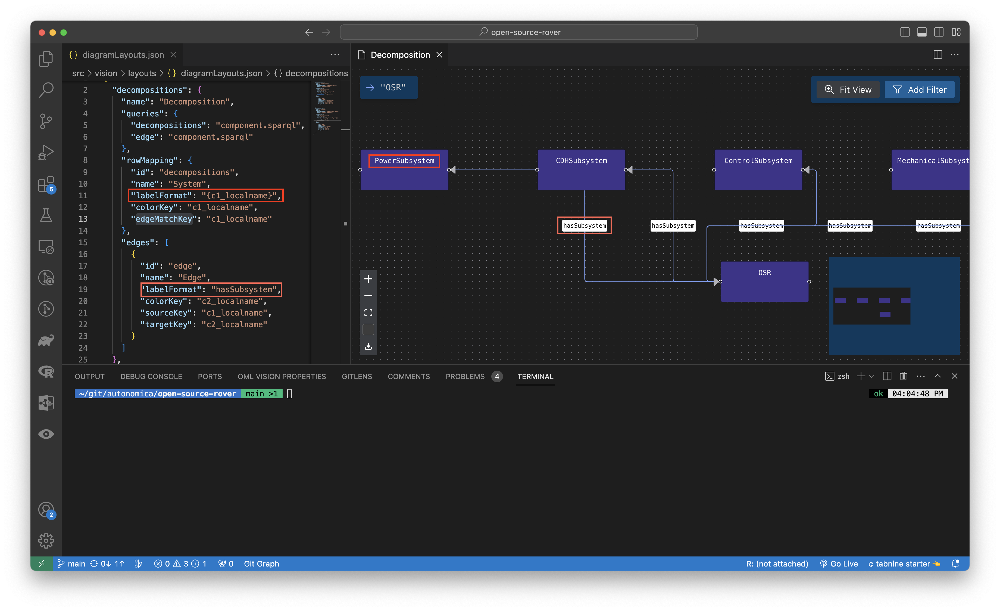
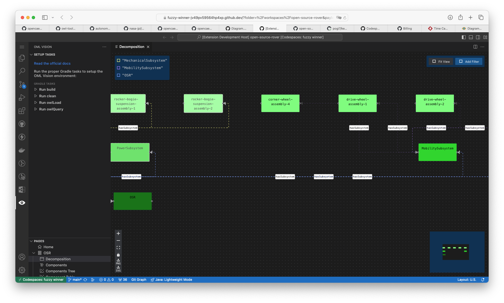
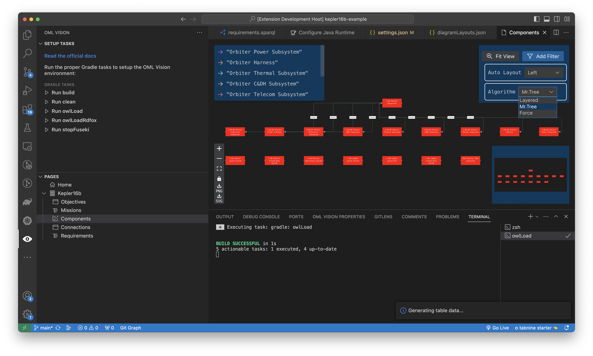

# Diagrams

Diagrams are created using [React Flow](https://reactflow.dev/).

:::info diagrams directory

Create a `src/vision/layouts/diagrams` directory (case-sensitive)

:::

The `src/vision/layouts/diagrams` directory is responsible for: 

- Defining what OML Vision Diagrams can render
  - Name of the Diagrams
  - Name of the nodes for the Diagram
  - Name of the edges for the Diagram
  - Queries for the Diagram node content
  - Queries for the Diagram edge content
  - How to map Diagrams node queries to edge queries

Each file in the directory is formatted as a JSON data structure.

<!-- TODO: Change to opencaesar repo -->
An example of what this looks like is seen below with the source code found [here](hhttps://github.com/pogi7/kepler16b-example/tree/layouts/src/vision/layouts/diagrams)

## Defining A Diagram

A Diagram must be properly defined in order to be rendered by OML Vision

### Terminology
OML Vision defines a node and edge as follows:

- Node: A graphical element that contains information
- Edge: A graphical element that connects information



### path
:::danger REQUIRED

```typescript
path: string
```

:::

This string defines the path of the Diagram.

:::tip USER INTERFACE

The name of the `path` is the same path that was defined in the `pages.json`.



:::

### name
:::note OPTIONAL

```typescript
name: string
```

:::


This string gives a name to the Diagram.  

### queries
:::danger REQUIRED

```typescript
queries: {}
```

:::

This object contains the queries that will query the RDF Triplestore for the content that will populate in the Diagram. 

**Look at the sparql docs for more info found [here](/docs/api-documentation/sparql)**

:::tip FUSEKI

You can test queries by going to localhost:3030 which is created once data is loaded into the Fuseki DB.  You can watch more info about testing queries with Fuseki by going [here](https://www.youtube.com/watch?v=w_pJ3XiBWeM&t=621s)

The AI & DS Channel (2021, February 18). SPARQL Query [Video]. YouTube. https://www.youtube.com/watch?v=w_pJ3XiBWeM&t=621s

:::

### rowMapping
:::danger REQUIRED

```typescript
rowMapping: {
  id: connections
  name: string
  labelFormat: string
  nodeColor: string
  nodeTextColor: string
  nodeType: string
  edgeMatchKey: string
}
```

:::

This object defines how the `queries` map to the `columnNames`

#### id
:::danger REQUIRED

```typescript
id: string
```

:::

This string the `id` for the `rowMapping`.

:::tip USER INTERFACE

The `id` correspond to one of the `columnNames`.



:::

#### name
:::note OPTIONAL

```typescript
name: string
```

:::

This string gives a name to the `rowMapping`.  

#### labelFormat
:::danger REQUIRED

```typescript
labelFormat: string
```

:::

This string contains the label of the row for the `rowMapping`.

:::tip USER INTERFACE

The `labelFormat` is rendered in the rows of the Diagram shown in the red boxes.

**STRING INTERPOLATION**

OML Vision supports string interpolation with the queries that were formatted.  The format is `"{string}"`.  Please visit the sparql section of the documentation for more info located [here](/docs/api-documentation/sparql)  

An example is found [here](https://github.com/pogi7/kepler16b-example/blob/layouts/src/vision/layouts/diagrams/components.json#L11)



:::

#### colorKey
:::warning DEPRECATED

```typescript
colorKey: string
```

This string is the seed for a random color generator for the nodes rendered in the Diagram.  Needed to generate the legend.

**STRING INTERPOLATION**

OML Vision supports string interpolation with the queries that were formatted.  The format is `"{string}"`.  Please visit the sparql section of the documentation for more info located [here](/docs/api-documentation/sparql)

:::

#### nodeColor
:::danger REQUIRED

```typescript
nodeColor: string
```

:::

This string sets the color of the nodes rendered in the Diagram.  Users can pick from a wide array of colors.  The full list is [here](https://github.com/opencaesar/oml-vision/blob/master/view/src/components/shared/colors.ts)

**Non Case Sensitive Spelling**

OML vision is smart enough to understand inputting the name of the color or the hex value.  These inputs are not case sensitive. 

Inputting `green`, `GREEN`, `Green`, or `#00ff00` will all output the color green to the nodes in the diagram view.

#### nodeTextColor
:::danger REQUIRED

```typescript
nodeTextColor: string
```

:::

This string sets the color of the text within the nodes rendered in the Diagram.  Users can pick from a wide array of colors.  The full list is [here](https://github.com/opencaesar/oml-vision/blob/master/view/src/components/shared/colors.ts)

**Non Case Sensitive Spelling**

OML vision is smart enough to understand inputting the name of the color or the hex value.  These inputs are not case sensitive. 

Inputting `green`, `GREEN`, `Green`, or `#00ff00` will all output the color green to the text of the nodes in the diagram view.

#### nodeType
:::danger REQUIRED

```typescript
nodeTextColor: string
```

This string sets the type of node in the diagram view.

OML Vision colors nodes which are of type "Assembly" and "Subsystem" differently than other nodes.  

The "Subsystem" node is automatically darkened relative to the `nodeColor`.

The "Assembly" node is automatically lightened relative to the `nodeColor`.

For an example of how these nodes are queried and configured look at the following example located [here](https://github.com/UTNAK/open-source-rover/blob/main/src/vision/sparql/component_filtered.sparql#L26-L37)

**STRING INTERPOLATION**

OML Vision supports string interpolation with the queries that were formatted.  The format is `"{string}"`.  Please visit the sparql section of the documentation for more info located [here](/docs/api-documentation/sparql)

:::

#### edgeMatchKey
:::danger REQUIRED

```typescript
edgeMatchKey: string
```

This string defines the edge for each node in the Diagram.

**STRING INTERPOLATION**

OML Vision supports string interpolation with the queries that were formatted.  The format is `"{string}"`.  Please visit the sparql section of the documentation for more info located [here](/docs/api-documentation/sparql)

:::

#### subRowMappings
:::note OPTIONAL

```typescript
subRowMappings: {
    id: string
    name: string
    labelFormat: string
    nodeColor: string
    nodeTextColor: string
    nodeType: string
    edgeMatchKey: string
  }[]
```

:::

This `subRowMappings` array of objects defines the `id`, `name`, `labelFormat`, `nodeColor`, `nodeTextColor`, `nodeType`, and `edgeMatchKey` for the subrows of the Diagram.

**The `id`, `name`, `labelFormat`, `nodeColor`, `nodeTextColor`, `nodeType`, and `edgeMatchKey` have the same data structure as `rowMapping`**

### edges
:::danger REQUIRED

```typescript
edges: {
    id: string
    name: string
    animated: boolean
    labelFormat: string
    legendItems: string
    sourceKey: string
    targetKey: string
  }[]
```

:::

This `edges` array of objects defines the `id`, `name`, `animated`, `labelFormat`, `legendItems`, `sourceKey`, and `targetKey` for the edges of the Diagram.

**The `id`, `name`, and `labelFormat` have the same data structure as `rowMapping`**

#### animated
:::danger REQUIRED

```typescript
animated: boolean
```

:::

This boolean defines whether or not all edges in the Diagram are animated are not.

#### legendItems
:::danger REQUIRED

```typescript
legendItems: string
```

This string defines the items that are populated in the legend in the diagram.  These items are automatically colored by OML Vision.

**STRING INTERPOLATION**

OML Vision supports string interpolation with the queries that were formatted.  The format is `"{string}"`.  Please visit the sparql section of the documentation for more info located [here](/docs/api-documentation/sparql)

:::

#### sourceKey
:::danger REQUIRED

```typescript
sourceKey: string
```

:::

This string defines the source node for the edge in the Diagram.


#### targetKey
:::danger REQUIRED

```typescript
targetKey: string
```

:::

This string defines the target node for the edge in the Diagram.

## Abilities

### Highlight Edges

Hightlight edges connected to nodes by clicking one or multiple nodes.  You can select multiple nodes by holding down the CMD (macOS) or Ctrl (Windows) key.

No Node Highlight with unlighted edges:


Node Highlight with highlighted edges:


### PNG Download 

In the lower left of the diagram, you can click the PNG icon to download the current state of the diagram to a PNG image.

### SVG Download 

In the lower left of the diagram, you can click the SVG icon to download the current state of the diagram to a SVG file.

### Lock/Unlock

In the lower left of the diagram, you can click the lock icon to unlock the nodes and edges in the diagram.  

When the diagram is unlocked you can select one or multiple nodes to move around.

You can lock the nodes and edges in the diagram by clicking the unlock icon.

### Change Node Layout Position

In the upper right of the diagram, you can click the Auto Layout dropdown to change the node position.

The position is based off of https://reactflow.dev/api-reference/types/position


### Change Algorithm Layout

In the upper right of the diagram, you can click the Algorithm dropdown to change the algorithm that is used to calculate the layout of the nodes and edges.

There are three available algorithms to select from:

1. [Layered](https://eclipse.dev/elk/reference/algorithms/org-eclipse-elk-layered.html)
2. [Mr.Tree](https://eclipse.dev/elk/reference/algorithms/org-eclipse-elk-mrtree.html)
3. [Force](https://eclipse.dev/elk/reference/algorithms/org-eclipse-elk-force.html)



### Parent-Child Nodes

You can create a parent-child relationship between nodes that can be represented in a block diagram.  This is done using a unique identifer called a [IRI](https://en.wikipedia.org/wiki/Internationalized_Resource_Identifier).  The IRI is obtained from a SPARQL query.  This SPARQL query specifies that a parent node contains one or more child blocks. The IRI of the child should be obtained with the ?iri key and the IRI of the parent should be specified with ?parentIri or a key ending with 'Iri'.

An example of how this is done can be found [here](https://github.com/UTNAK/blockdiagram-demo?tab=readme-ov-file#oml-vision-demo-of-block-diagram-views)
