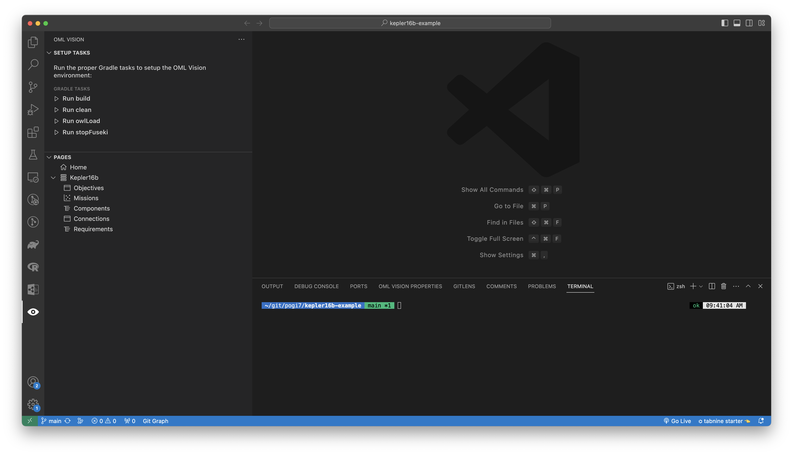

# Get Started

Let's discover **OML Vision in less than 5 minutes**.

## Getting Started

### VSCode Terminology (Optional)

:::tip VSCode Terminology

While not required, it is recommended to read the documentation on VSCode terminology as it will be referenced heavily.  Read more [here](https://code.visualstudio.com/docs/getstarted/userinterface)

:::

### Install OML Vision

#### VSCode Marketplace (Automatic Installation)

<!-- TODO: Add link to VSCode marketplace -->
1. Go to VSCode Marketplace and install the extension from there.  

#### VSIX File (Manual Installation)

1. Go to latest release of [OML Vision](https://github.com/opencaesar/oml-vision/releases/latest)
2. Download the VSIX file
3. Install the OML Vision extension using the downloaded VSIX file.  Helpful guide [here](https://code.visualstudio.com/docs/editor/extension-marketplace#_install-from-a-vsix)

### What you'll need

#### Windows
1. Install scoop https://scoop.sh/#/
2. Use scoop to install `git`, `nodejs`, `nvm`, `yarn`, `java17` and `visual studio code` if not already installed.
```bash
scoop bucket add main
scoop bucket add extras
scoop bucket add java
scoop install main/git
scoop install main/nodejs
scoop install main/nvm
scoop install main/yarn
scoop install java/openjdk17
scoop install extras/vscode
```
3. The version of VSCode must be at `1.78.2` or newer.
4. Install the following VSCode extensions if not already installed
```bash
code --install-extension vscjava.vscode-java-pack
code --install-extension vscjava.vscode-gradle
```

#### macOS
1. Install homebrew https://brew.sh
2. Use scoop to install `git`, `nodejs`, `nvm`, `yarn` and `visual studio code` if not already installed.
```bash
brew install git
brew install nodejs
brew install nvm
brew install yarn
brew install openjdk@17
brew install --cask visual-studio-code
```
3. The version of VSCode must be at `1.78.2` or newer.
4. Install the following VSCode extensions
```bash
code --install-extension vscjava.vscode-java-pack
code --install-extension vscjava.vscode-gradle
```

## Load OML Model Data

OML Vision is designed to work with OML (Ontological Modeling Language) models.

### Start from Scratch

Tutorials on how to create an OML model from scratch can be found [here](https://www.opencaesar.io/oml-tutorials/)

:::danger No OML Vision viewpoints defined in above tutorial
OML Vision works with viewpoints which will be covered in `Layouts` found [here](/docs/v0.2.5/category/layouts)
:::

### Use existing OML model

If you want to see the capabilities of OML Vision without creating your own OML model you may use one of the following OML models:

<!-- TODO: Change URL to opencaesar organization once documentation is updated -->
- [Kepler16b](https://github.com/pogi7/kepler16b-example/tree/main): A hypothetical spacecraft that will explore the [Kepler16b exoplanet](https://en.wikipedia.org/wiki/Kepler-16b)
- [Open Source Rover](https://github.com/UTNAK/open-source-rover/tree/main): A descriptive model of the [JPL Open Source Rover](https://github.com/nasa-jpl/open-source-rover/tree/master)

1. Click the eye icon in the sidebar which will activate the OML Vision extension
2. Your screen should look like this


1. Click `Clone OML Model` and enter in this URL https://github.com/pogi7/kepler16b-example.git


:::tip Command Line Interface

You can also run this command from the command line using 
```bash
git clone https://github.com/pogi7/kepler16b-example.git
```
:::

4. Open the kepler16b-example OML model in VSCode

### Start OML Vision

1. Your screen should look like this

2. Click the eye icon in the sidebar which will activate the OML Vision extension
3. Your screen should look like this


4. Data must be loaded into the in-memory RDF triplestore for OML Vision to render views
5. Click `Run clean` (This will clear the cache i.e.delete the build folder)

:::tip Command Line Interface

You can also run this command from the command line using 
```java
./gradlew clean
```
Look in the [build.gradle](https://github.com/pogi7/kepler16b-example/blob/layouts/build.gradle) file for a list of commands
:::

6. Click `Run owlLoad` (This will load data into the in-memory RDF triplestore)

:::tip Command Line Interface

You can also run this command from the command line using 
```java
./gradlew owlLoad
```
Look in the [build.gradle](https://github.com/pogi7/kepler16b-example/blob/layouts/build.gradle) file for a list of commands
:::

7. Click `Objectives`
8. Your screen should look like this
